## 1.机器学习基本概念

### 1.1 机器学习的任务

- **回归任务（regression）**：输出一个数值
- **分类任务（classification）**：输出一个类别
- **结构式学习（structed learning）**：输出一个图片、音频等

### 1.2 机器学习的过程

1. 定义模型—— $y = b+wx$
   - 与feature相乘的参数 w -> **weight**
   - 没有跟feature相乘的参数 b -> **bias**
   - 已知的东西 x -> feature
2. 定义 loss —— 关于参数b和w的函数，反映$y和\hat y$的差距
   - Mean Absolute Error
   - Mean Square Error
   - Cross-entropy
3. 最优化(Optimization)
   - **梯度下降（Gradient Descent）**——存在只有局部最优解，找不到全局最优解问题
     1. 选择一个初始值
     2. 根据Loss函数计算梯度并更新参数
   - 参数变化速率影响因素
     - **学习率（learning rate）**
       - 这种自己设置的参数就是**超参数(hyperparameters)**
     - 当前点梯度大小

### 1.3 激活函数（Activation Function）

#### 1.3.1 sigmoid

- 如果y跟x关系比较复杂，用线性模型（liner model）显然难以拟合，所以需要更复杂的模型

- 可以将一个复杂的曲线，看做一个常数加上多个函数，这个函数可以是**sigmoid function**

  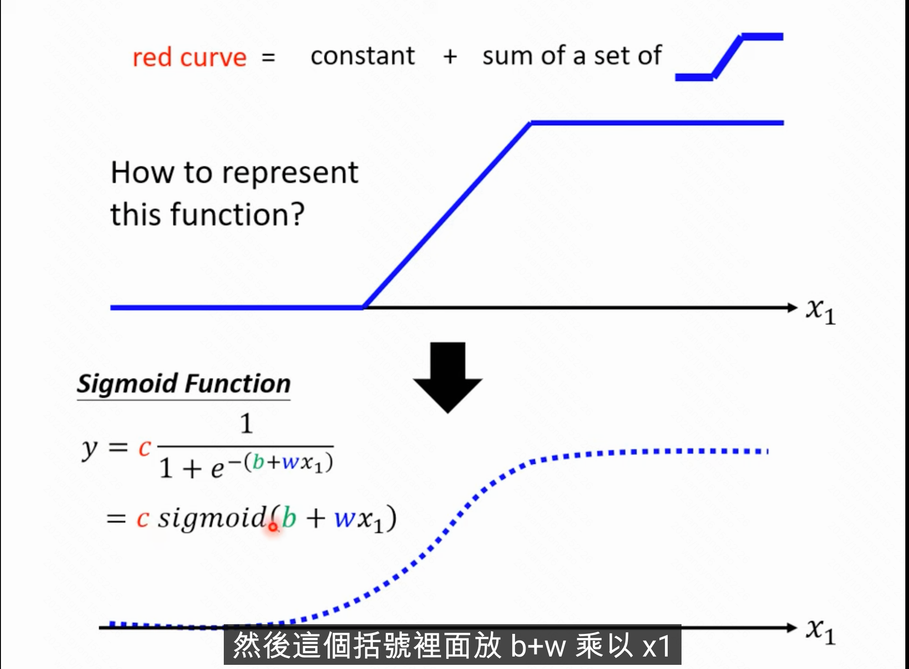

  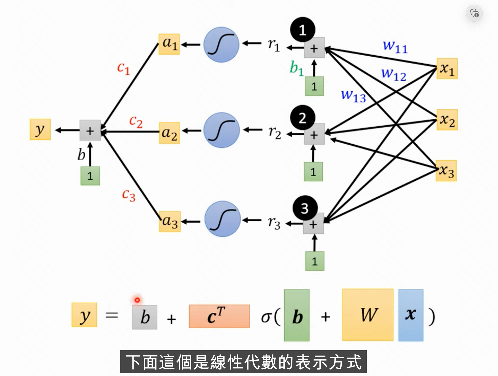

- 最后可以将这些参数拼成统一参数向量$\theta$，梯度$g=\nabla L(\theta^0)$
- 除了增加sigmoid的数量，还可以增加sigmoid的次数，也就是增加层数(Layer)，形成神经网络(Neural Network)

#### 1.3.2 Rectified Linear Unit（ReLU)

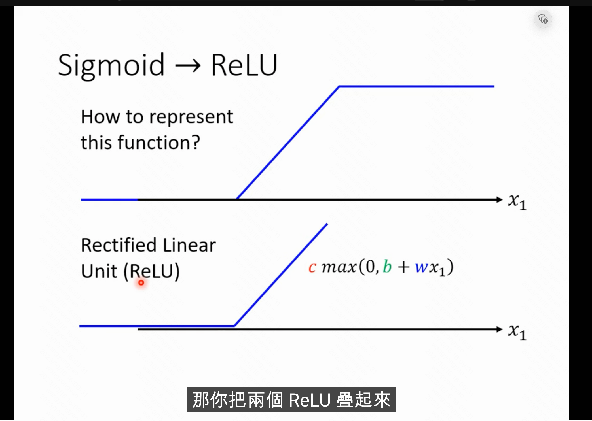

### 1.4 过拟合（Overfitting）

- 指在训练集上loss低，但测试集loss高

- 比如一组满足二次函数的数据，网络层数很深(弹性大)时，只用几个点就能拟合，但这几个点之外的函数就没有限制，导致测试集上结果不好。

- 虚线指的是数据的真实分布，实线指拟合的曲线

  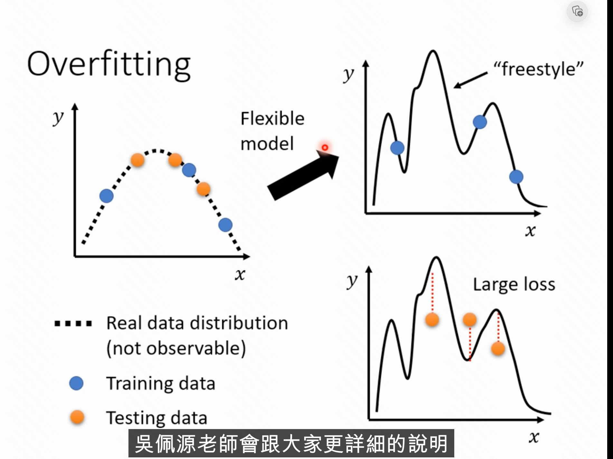

- **解决方法**

  - 增加训练集
  - **数据增强(Data Augumention)**
    - 简单方法：翻转、旋转、尺度变换、随机抠取、色彩抖动、高斯噪声、随机模糊、随机擦除
    - **复杂方法**：Fancy PCA、监督式抠取、GAN生成
  - 增加限制、减少参数——比如CNN
  - **Regularization**
  - **Dropout**

### 1.5 模型选择方法

- 将训练集再分为训练集和验证集(Validation Set)，提高模型泛化能力，避免模型过于拟合测试集
- N-fold Cross Validation，将训练集分为N份，分别以第i份训练集为验证集，做N次训练，得到最低Loss

## 2. 优化

### 2.1 Optimization为什么会失败？

随着gradient更新次数的增加，gradient渐渐趋于0，training loss虽然在减小但不够小（下图蓝线）；或者一开始gradient就在0附近震荡（下图黄线）。

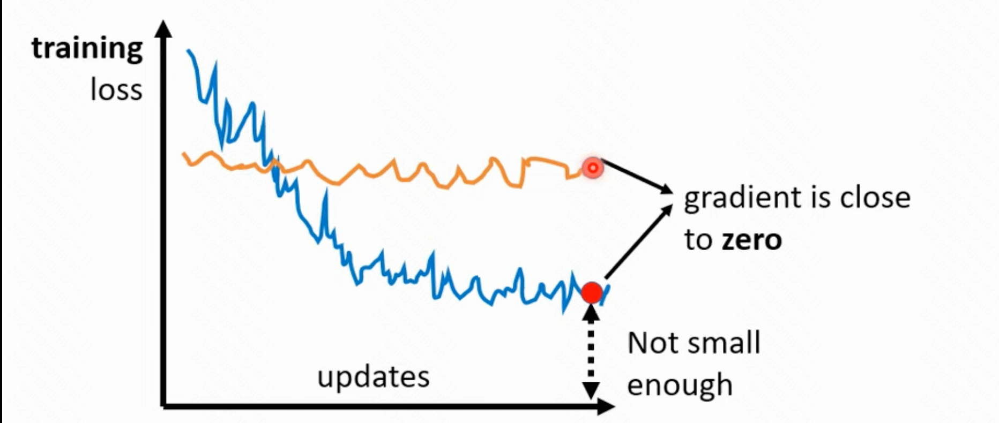

gradient趋近于0说明在critical point（驻点）附近，此时包括2种情况：**局部最小值(local minima)**和**鞍点(saddle point)**，另一种local maxima的情况不影响gradient的更新。

### 2.2 批次(batch)和动量(momentum)

#### 2.2.1 Batch

batch就是训练的最小单位，将一个batch中的所有样本的loss计算出来后，更新一次模型参数θ。把所有的batchs过一遍叫做一个epoch，每个epoch之后会将训练集全部打乱。

**small batch**训练出来的模型的**泛化能力更好**，可能的解释是：小的batch每次update的方向都不太一样，更有可能跳出sharp minima，被sharp minima困住的可能性更小，进入flat minima的可能性更大。

#### 2.2.2 momentum

调整参数时不光根据当前梯度的方向，还根据上一步移动的方向。

### 2.3 自动调整学习率(Adaptive Learning Rate)

#### 2.3.1 Adagrad

- 不同的参数使用不同的learning rate

- Root Mean Square (RMS)，用于Adagrad中。

  - 该方法认为之前的每一个g都同等重要。
  - 坡度小时，g也小，$\sigma_i^t$就小，$\frac{\eta}{\sigma_i^t}$就大，更新步子就大；坡度大时，g也大，$\sigma_i^t$就大，$\frac{\eta}{\sigma_i^t}$就小，更新步子就小。

  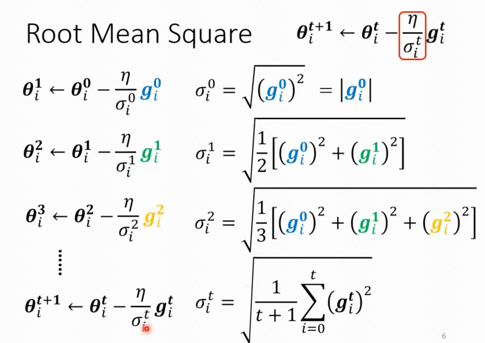

#### 2.3.2 RMSProp

- Adagrad方法还是存在缺陷，比如在经过很**漫长的平滑区域积累了很大的learning rate**,此时很可能突然遇到Loss曲线陡峭的情况，但因为learning rate很大而直接跳过。
- RMS Prop办法不仅要考虑之前累计的信息，也要考虑当下的信息。其参数更新为：

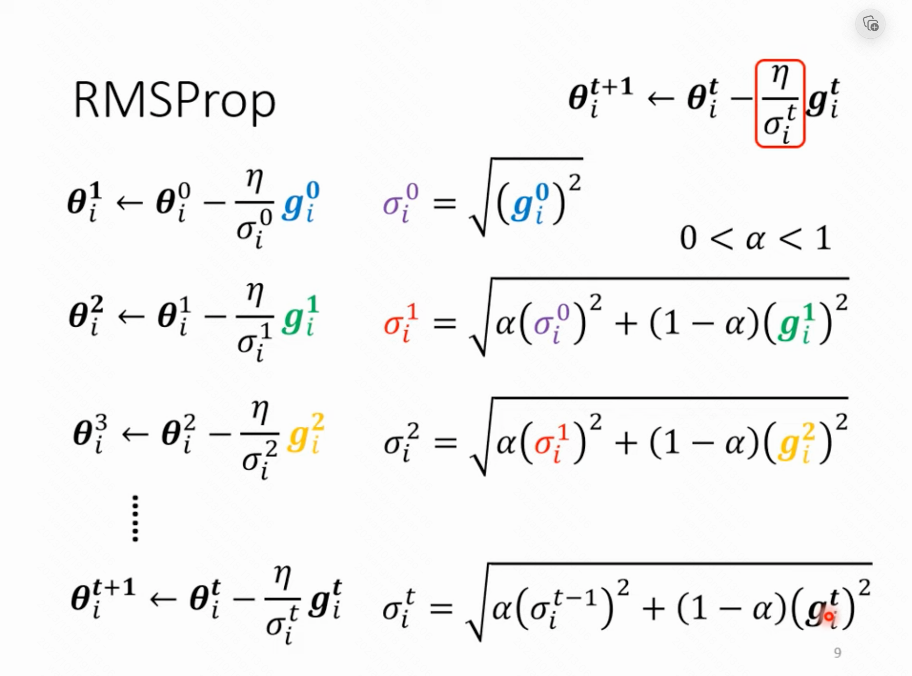

- 这样根据调整$\alpha$的值就可以设定时更关注于当下还是之前

#### 2.3.3 Learning Rate Scheduling

- **Learning Rate Decay**
  - 随着参数不断更新，逐渐减小学习率$\eta$
- **Warm Up**
  - 学习率先变大，再变小
  - 这个方法实用的一个可能的解释是当我们在用Adam RMS Prop我们会需要计算σ,它是一个统计的结果。σ告诉我们,某一个方向它到底有多陡或者是多平滑,那这个统计的结果要看得够多笔数据以后才精确,所以一开始我们的统计是不精确的，所以我们一开始不要让我们的参数离初始的地方太远,先让它在初始的地方呢做一些像是探索这样,所以一开始learning rate比较小,是让它探索收集一些有关error surface的情报，等σ统计得比较精準以后,在让learning rate呢慢慢地爬升。

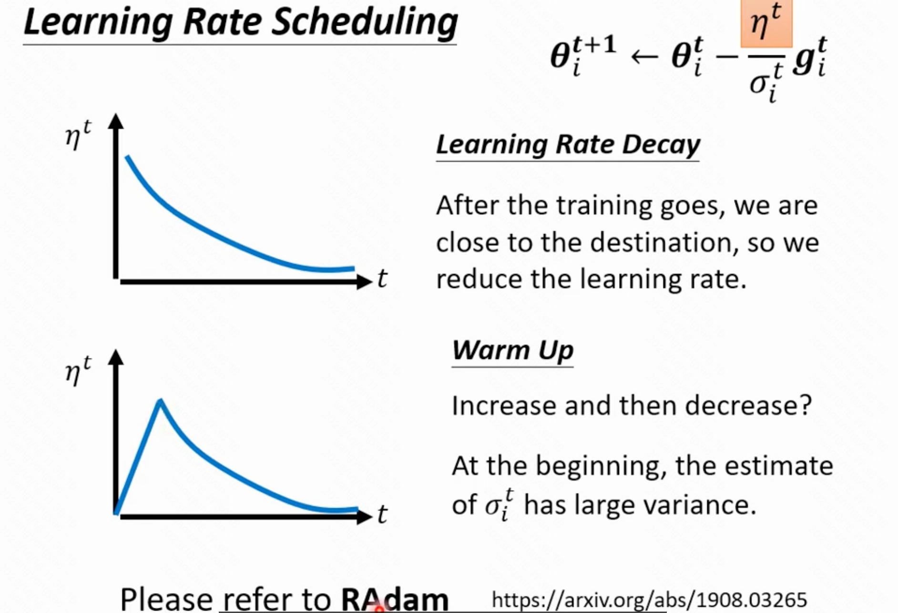

#### 2.3.4 Adam: RMSProp + Momentum

- $\theta_i^{t+1} = \theta_i^t-\frac{\eta^t}{\sigma_i^t}m_i^t$
- $m_i^t$：momentum是一个向量，反映过去所有gradient的总和
- $\sigma_i^t$：是一个标量，也反映过去所有gradient的总和，但没有方向

### 2.4 Loss函数

#### 2.4.1 分类问题

- 某些情况下可以将分类问题，将类别1编号为1，类别2编号为2，类别3编号为3，但**这意味着类别1和类别2更接近，和类别3差别更大**。因此会将类别按**独热码**编码。（？猫、狗、苹果？）

- 将回归问题输出的一个结果，改为3个结果即可(乘上不同的weight)

- 通常会将结果做一个softmax，使$y^,$介于0和1之间，同时加深值之间的差距

- 最后计算$y^,$和$y$之间的差距

  - Mean Square Error

  - Cross-entropy(用于分类问题更合适)

  - 可發現當Loss很大的時候 Cross-entropy有斜率 Mean Square Error比較平坦→可能會卡住，雖然可以用Learning rate解決，但Traning起步仍是較困難的

    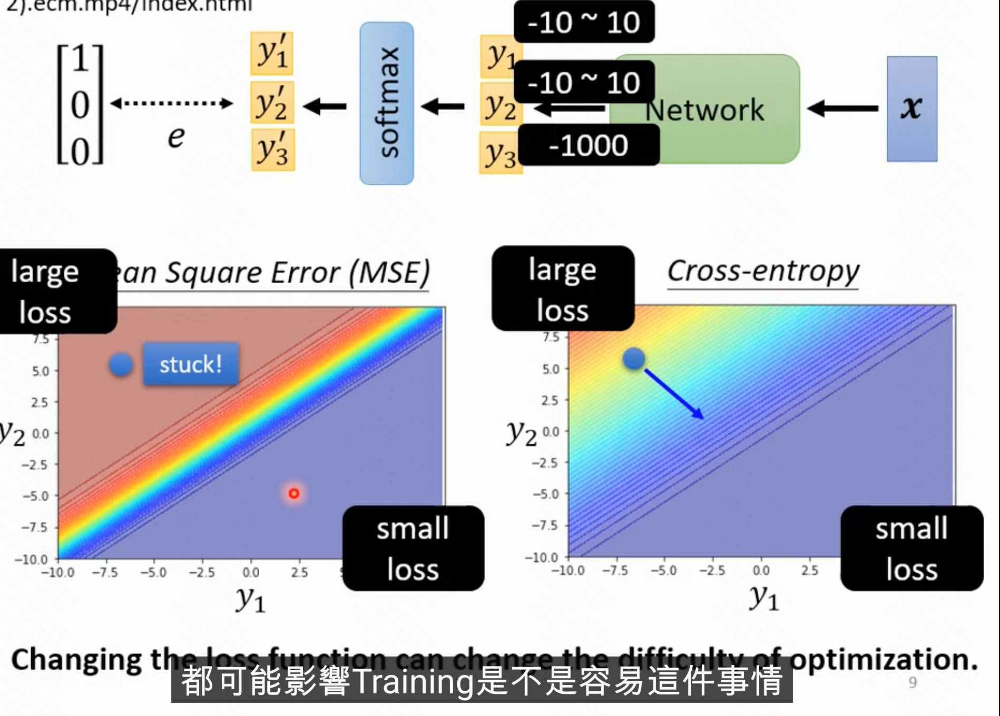

### 2.5 批次标准化(Batch Normalization)

- 当不同feature的尺度差距很大时，需要标准化让training更容易。
- 对每一层的输入都要标准化。
- 由于数据集很大，所以通常只对一个batch做标准化。
- 在实际使用时，由于每次只有一个数据传入，因此需要将每个batch算出来的$\mu和\sigma$记录供服务使用。

## 3 Convolutional Neural Network——常用于图像

- 电脑中一张图片是一个三维的Tensor，长、宽、channel

  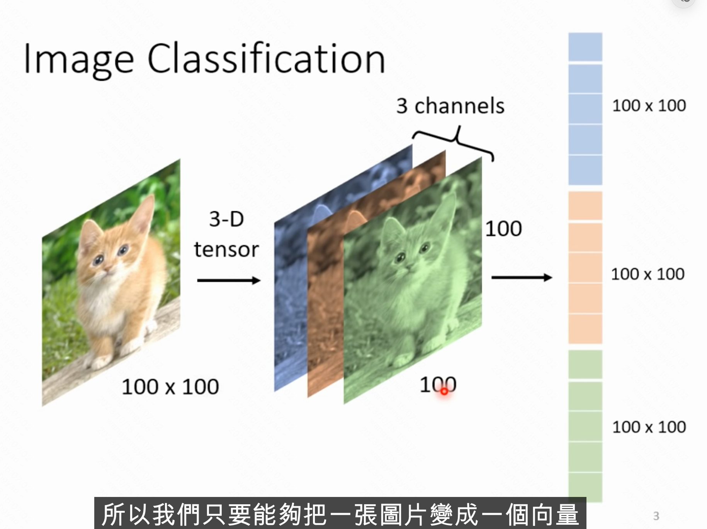

### 3.1 为什么要不用fully connected network处理图像呢？

- 全连接的神经网络弹性很大，每一个neuron都可以看到图片每个通道的每一个pixel（像素）。

  1. 首先出现的一个问题是**计算量十分大**。假设图片的size是(100, 100, 3)，input就一共有3w个数字，经过几层的layer之后，计算量成指数级上升。

     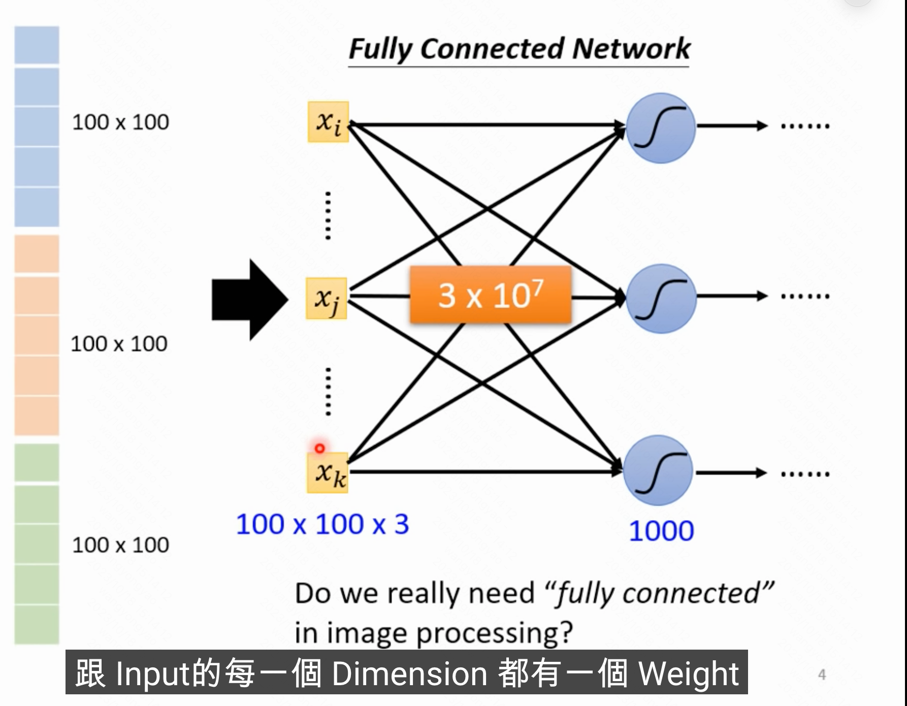

  2. 当我们在辨认物体时，只要抓住**关键特征**就可以确定这是什么物体，不需要看整张图片。

### 3.2 简化全连接网络的方法

#### 3.2.1 感受野(receptive field)

- 每个Neuron只需要关心一个感受野中的输入，就可以减少参数。

  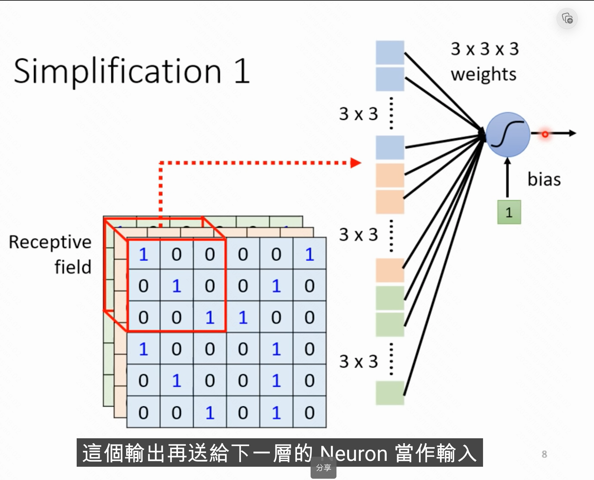

- 最常用的感受野设置方法

  - 大小称为kernel size，通常使用3x3，但有的特征可能用3x3感受不出来

  - 用**一组神经元**去守备一个感受野，如64个，128个

  - 每个感受野的距离称为stride，往往设置比kernel size小，因为希望感受野有重叠，从而可以感受到**跨感受野的特征**。

  - 如果感受野超出图片范围后，需要增加数据，称为padding。

    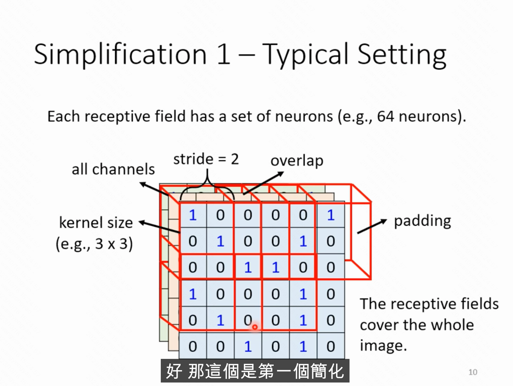

#### 3.2.2 共享参数

- **一种关键特征(pattern)可能出现在图片的不同位置**

- 比如两个神经元都是用于检测鸟嘴这个特征，只是检测的感受野不同，因此可以让这两个神经元**共享参数(parameter sharing)**，也就是两个神经元的weight完全一样

- 虽然参数一样，但感受野不同，所以输出也不会一样。因此不会让守备同一个感受野的两个神经元共享参数。

- 常用共享参数方法

  - 每一个感受野都有一组神经元守备。

  - 每一个感受野的某个神经元都和别的感受野某一个神经元共享参数。

    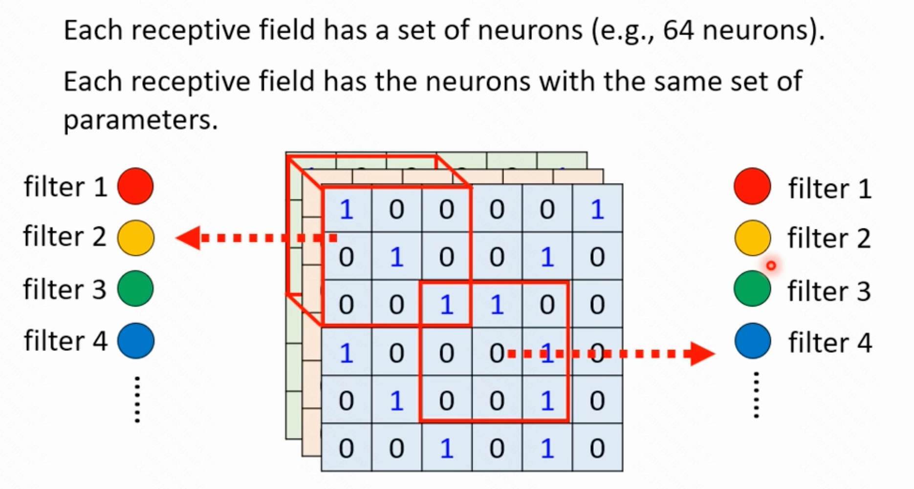

- 实际上就是每个filter依次去与每个感受野做卷积。

#### 3.2.3 池化(pooling)

- 将filter卷积后产生的feature map，每个池化区域只取一个值，减小图片大小，减少运算量。

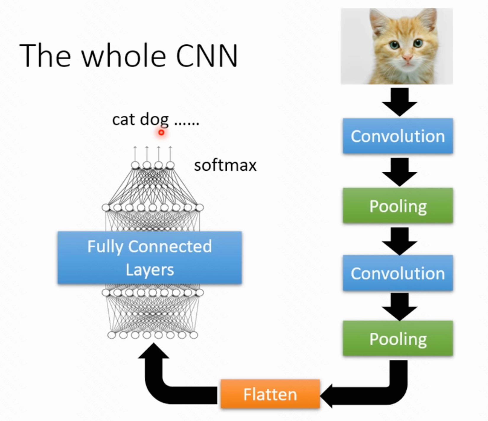

## 4 Self-Attention

### 4.1 Word Embedding

#### 4.1.1 独热编码

- 使用独热码编码每一个单词，但是这样导致单词之间没有任何关系，因此会使用Word Embedding方法，让类似语义的单词在图上比较接近。

  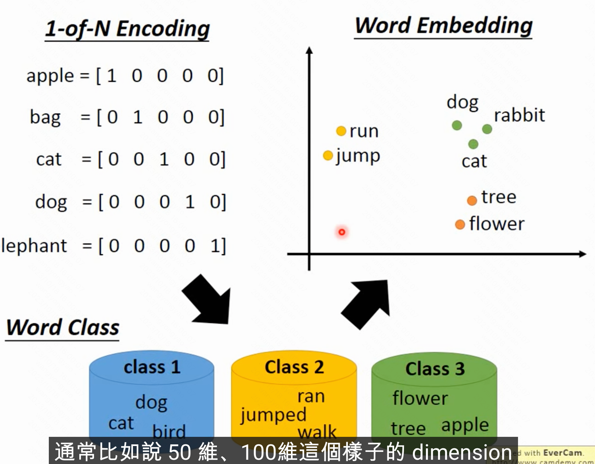

#### 4.1.2 Word Embedding

- 无监督的训练方法。
- 根据上下文。

### 4.2 Self-attention 内部是怎么运作的？

- self-attention是将初始输入转化成**带有整个sequence的信息**的输出
- 假设$a_i$是输入层或某一个hidden layer的输入向量组（或input seq），$b_i$ 是经过self-attention机制后考虑了整个seq信息的向量组，以如何得到$b_1$为例解释self-attention机制。
- a1要考虑seq中的a2, a3, a4，**找到与判断a1标签这件事相关的vector**，每一个向量跟a1的相关性用α衡量，α越大关联越大。

#### 4.2.1 $\alpha$的计算方法

- 有三个矩阵$W_q$、$W_k$和$W_v$，分别用于计算Query向量、Key向量和Value向量

  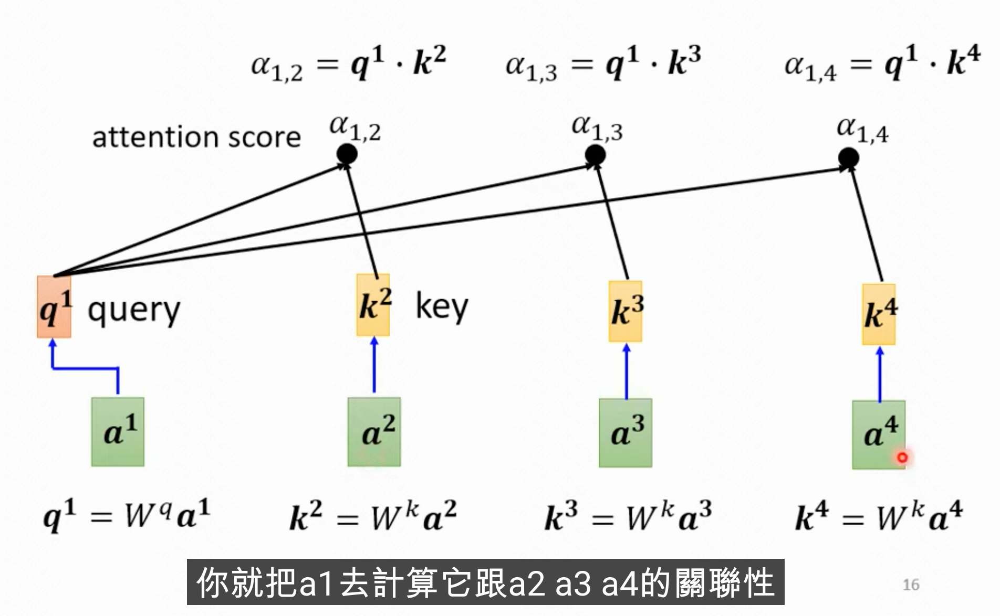

- 通常$a^1$也需要计算和自己的关联程度，再做一个softmax(或者别的激活函数)来标准化

  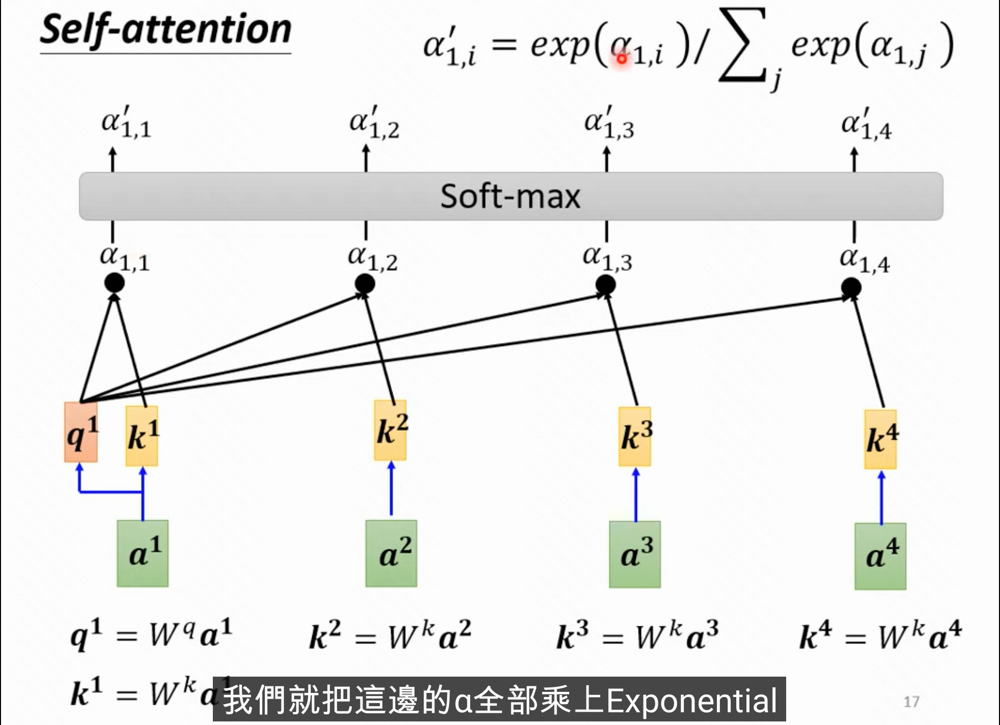

- 再用$W_v$点乘每个向量得到$v^i$，$v^i$依次与softmax得到的$\alpha^\prime_{1,i}$点乘后相加得到$b^1$

  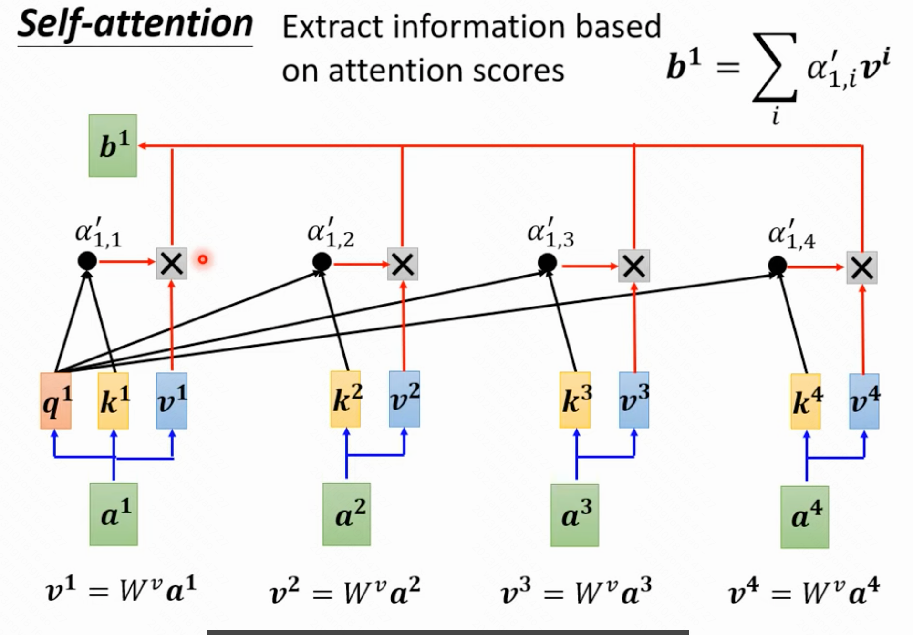

- 矩阵形式

  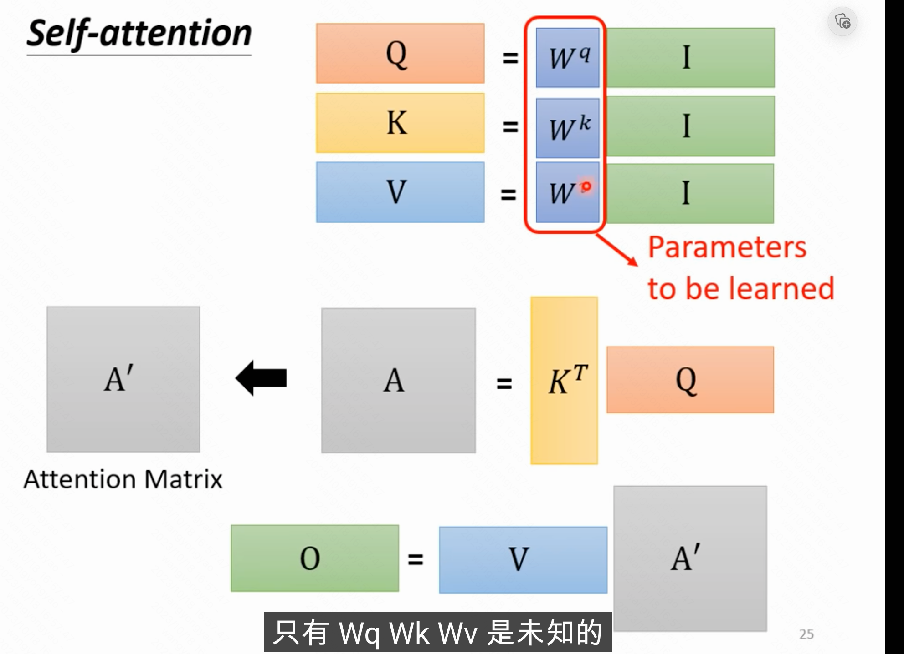

### 4.3 Multi-head Self-attention

- 计算时会产生两组q,k,v，表示需要找到两个不同的相关性。

  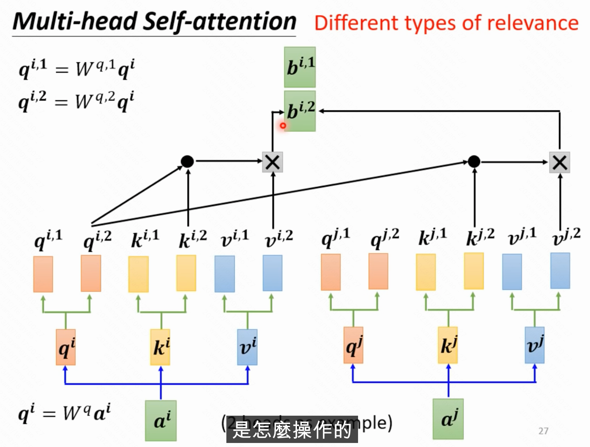

### 4.4 Positional Encoding是什么？

- 目前为止network中还没有**位置信息**，训练中加入向量所处位置的信息，就叫Positional Encoding
  - 为每一个位置设定一个唯一的向量$e^i$
  - $a^i+e^i$就可以了

## 5 Transformer

- seq2seq的模型通常具有encoder,decoder两个结构

### 5.1 Transformer Encoder

Encoder的input sequence长度为N，out seq的长度也为N

1. 首先，将inputs加上Positional Encoding，得到新的inputs
2. 将上一步的结果作为多头注意力机制的输入，得到相应的output
3. Residual：将输出a，加上原来的输入b，得到residual
   - 这一步称为**残差连接(Residual Connection)**，通常用于解决梯度消失和梯度爆炸的问题，帮助模型更快收敛。

4. norm：将residual经过**layer normalization(不是batch normalization)**

   - 对同一个example里面不同的dimension做标准化

     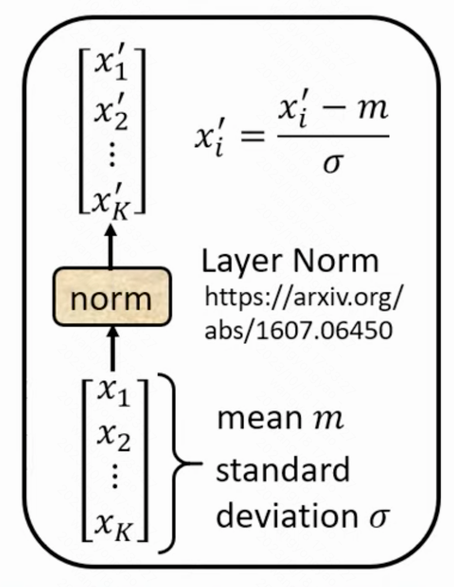

5. 经过FC：将norm之后的输出送入fully connected network(原论文中写的是Feed Forward)

6. Residual：再做一次残差连接，将第4步标准化后的输出加上第5步的输出

7. norm：再进行一次norm最终得到一个**block**的输出

   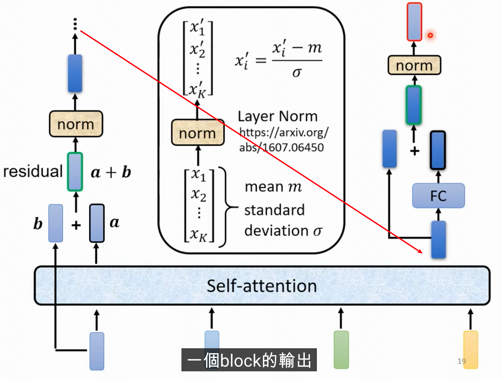

### 5.2 Transformer Decoder

- decoder分为autoregressive(AT), non-autoregressive(NAT) 两种

  - autoregressive(AT)

    - 在Encoder完成之后，将其输出作为一个输入喂到Decoder中。

    - 同时，输入一个special token：START表示开始工作。

    - Decoder结合这两个输入，**输出一个经过softmax处理后的长度为Vocabulary Size的输出向量，该向量中每一个中文字都对应一个数值，数值最大的中文字为最终输出的中文字**，下图中，输出的结果是“机”。

    - 接下来，将“机”对应的向量作为Decoder的输入，做下一步计算。这样Decoder会考虑下边两个输入

      - START对应的向量
      - “机”对应的向量

    - 接下来，将“器”对应的向量也作为Decoder的输入，这样Decoder会考虑下边三个输入

      - START对应的向量
      - “机”对应的向量
      - “器”对应的向量

      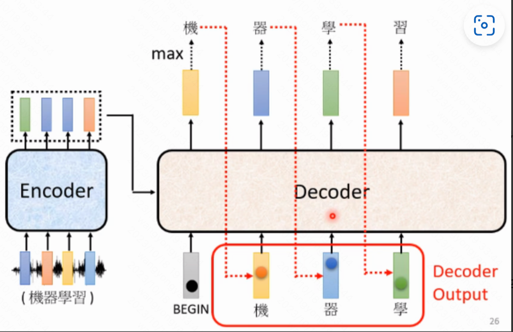

  - non-autoregressive(NAT) 

    - **NAT decoder一次性产生一整个句子**。

- Decoder相较Encoder新增了一个**Masked Multi-Head attention**

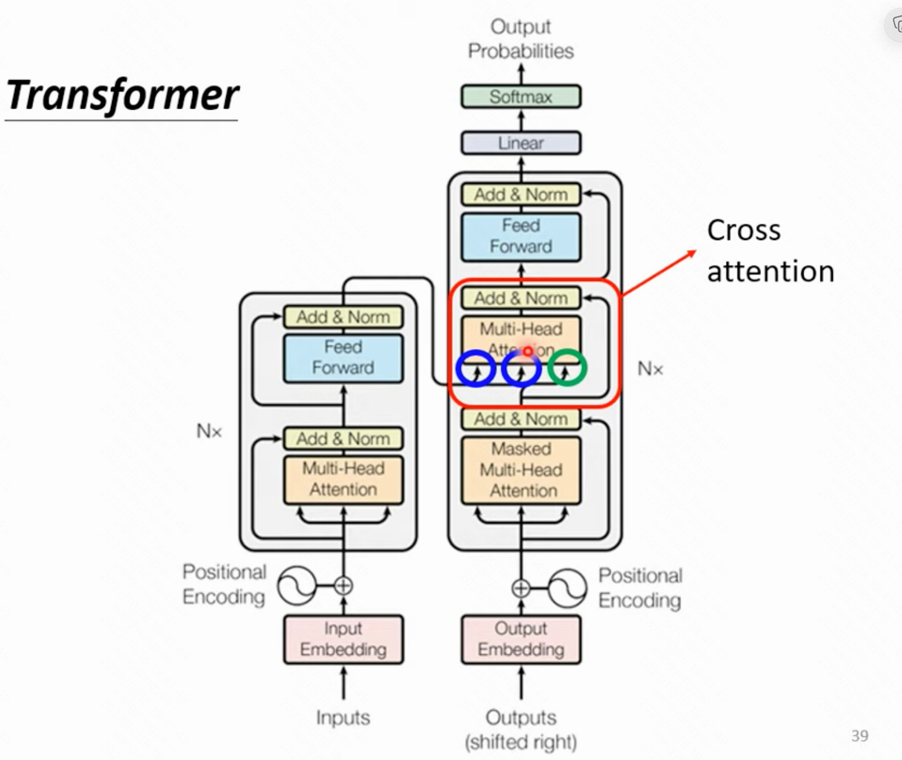

#### 5.2.1 Masked Multi-Head attention

- 不能再每一个输出都得到所有seq的信息，只能使用已经使用过的input的信息。比如$b^1$只能使用$a^1$，而$b^2$可以使用$a^1$和$a^2$.
- 因为transformer decoder是序贯产生输出了，看了右边的input vectors也没用。**和Decoder的串行计算顺序相对应的**

#### 5.2.2 encoder和decoder传递信息

- encoder和decoder进行交流的模块是**cross attention**，**它有三个输入，两个输入来自encoder，一个输入是masked attention的输出。**

##### 5.2.2.1 Cross attention的运行过程

- 左边是encoder及其输出，右边是decoder的self-att (masked)部分，self att (masked)输入begin token之后产生了第一个输出，该输出经过linear transform生成一个query q，再和左边encoder的k, v做cross attention。**所以可以理解为query q去抽取encoder的信息，作为decoder中fully connected network的输入。**

  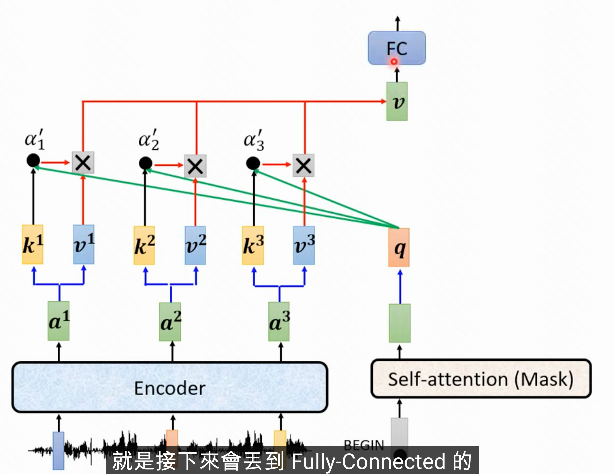

### 5.3 Transformer的训练

